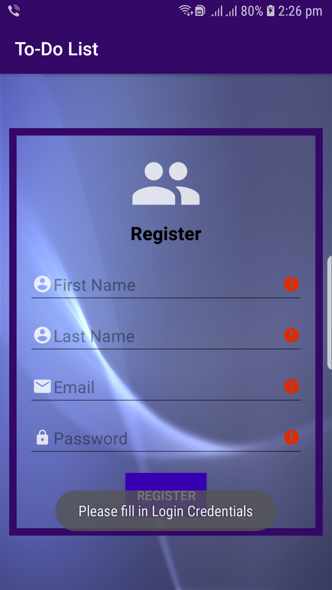

# todo
The main purpose of the Todo is to help organize tasks and learning how to effectively use them can benefit in doing tasks on scheduled date which improves time management abilities and decreases stress levels.

1. You need to register yourself first to get access of the todo application by filling up your first name, last name, email address and password.

2. The register form is validated so if one puts incorrect email address format or password that is less than 6 characters it throws a error message.

