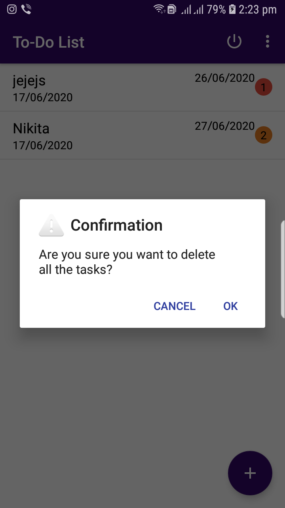

# todo
The main purpose of the Todo is to help organize tasks and learning how to effectively use them can benefit in doing tasks on scheduled date which improves time management abilities and decreases stress levels.

1. You need to register yourself first to get access of the todo application by filling up your first name, last name, email address and password.

2. The register form is validated so if one puts incorrect email address format, empty first name, last name or password that is less than six characters it throws a error message.

3. You will automatically get logged in to the todo app.

4. If you need to login into the todo app you can do that by filling in your email address and password. 

5. The login form is validated so if you put incorrect email address it will pop a invalid email address message and error warning when the field is empty as well.

6. The password field is also validated so you cannot put any incorrect password to login.

7. You cannot login with empty fields as well the fields must be filled in with correct credentials.

8. You can add new task by clicking on the + sign button on the bottom right corner and as well as you can see the task you have already created.

9. By clicking on the new task you will see the description of the task to get added, select priority of the task and can select the due date of the task.

10. You can add the task description that is yet to be done and select the priority if the task is very important or important or moderate and can select the date for the last due date of the task and if you feel like not typing the task down you can use the auto voice message where the task can be recorded and auto set.
<tr>
  <td></td>
  <td></td>
  <td></td>
</tr>

11. You can update the task description, date and set priority as well.

12. You can delete the task by swiping left or right which shows a pop up message and can delete all the task as well by going into the tool bar menu and slecting delete all task.

13. If you want to undo the task you can do that as well it shows a pop up message when you delete a task saying if you want to undo the task.

14. You can logout by clicking on the switch like button which will log you out and redirect you to the login page.

